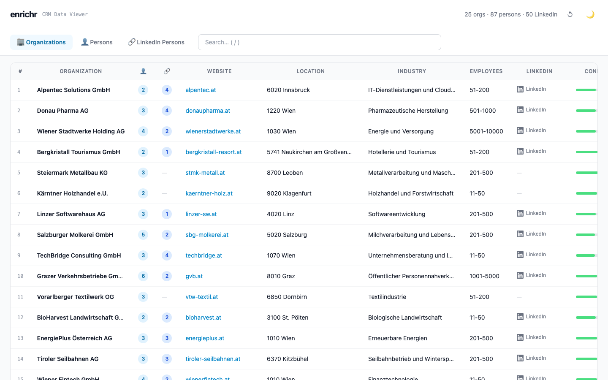
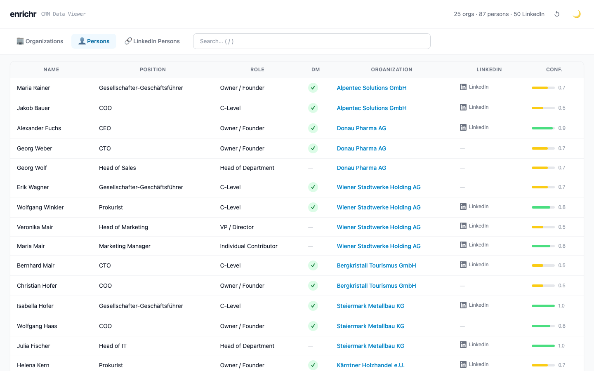
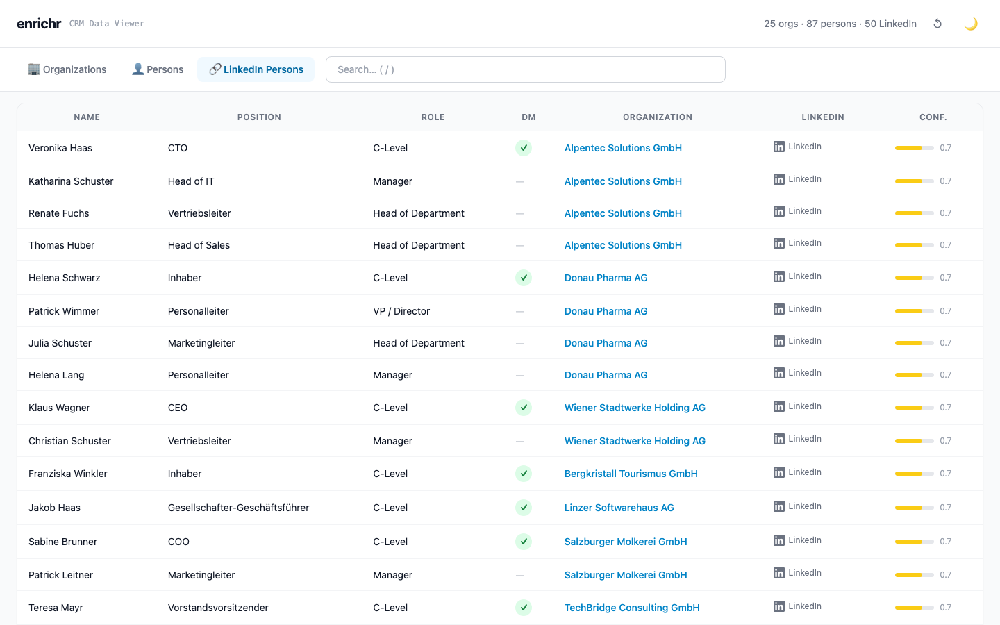
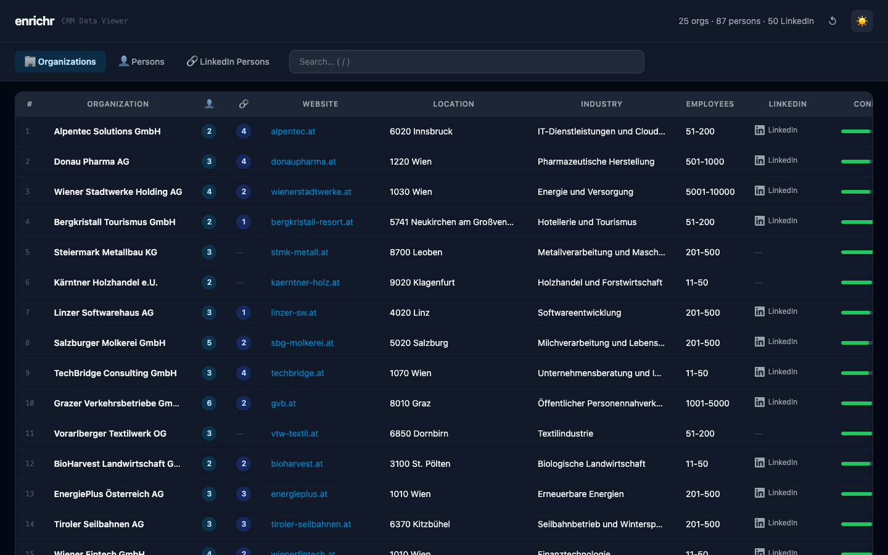
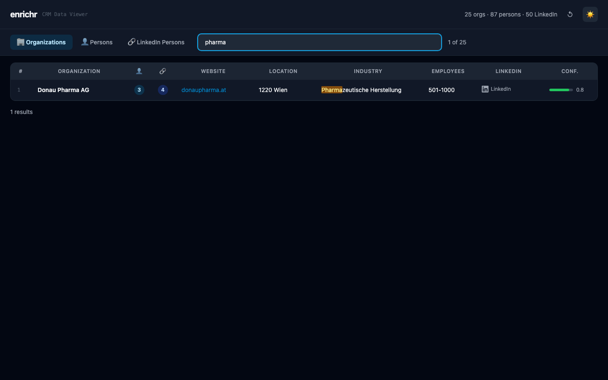

# Enrichr

Multi-stage company and person enrichment pipeline for Pipedrive CRM. Uses LLM knowledge (Claude, GPT, Gemini, etc.) + HTTP verification + LinkedIn scraping to build structured, Excel-compatible datasets from company names.

**Pipeline:** Company names → LLM enrichment → Website crawling → Person extraction → LinkedIn scraping → Interactive viewer



## Features

- **Company Enrichment** — Look up structured company data (website, address, industry, UID, phone, email, LinkedIn) from a company name
- **Person Extraction** — Crawl company websites to find contact persons with roles, emails, phone numbers
- **LinkedIn Scraping** — Scrape LinkedIn company pages to find decision makers and key people
- **Interactive Viewer** — Self-contained HTML viewer with search, tabs, dark mode, and resizable columns
- **Excel-compatible CSV** — Semicolon-separated, UTF-8 BOM, CRLF, Excel-safe value escaping
- **Multi-model** — Supports Claude, GPT, Gemini, and any model via the pi SDK
- **Resumable** — Batch jobs can be interrupted and resumed without losing progress

## Screenshots

| Organizations | Persons | LinkedIn Persons |
|:---:|:---:|:---:|
|  |  |  |

| Dark Mode | Search with Highlighting |
|:---:|:---:|
|  |  |

## Setup

```bash
brew install just node          # prerequisites
just setup                      # install all npm dependencies
pi /login                       # authenticate with your LLM provider
```

## Quick Start

### 1. Enrich Companies

```bash
# Single lookup → JSON
just company-lookup "Acme GmbH, Wien"

# Batch → CSV (5 parallel, resumable)
just company-batch --in orgs.csv --out enriched.csv

# Retry rows with missing fields
just company-retry .work/data_out/orgs.csv
```

### 2. Extract Persons from Websites

```bash
# Single website → JSON
just person-lookup "www.example.at"

# Batch: crawl all org websites → CSV
just person-batch --in .work/data_out/orgs.csv --out .work/data_out/persons.csv --prompt "all contacts"
```

### 3. Scrape LinkedIn People

```bash
# Start Chrome with separate profile (login to LinkedIn once)
just chrome-linkedin

# Batch scrape LinkedIn people
just linkedin-batch in=.work/data_out/orgs.csv out=.work/data_out/linkedin-persons.csv prompt="decision makers"
```

### 4. View Results

```bash
# Build self-contained HTML viewer (embeds all CSV data)
just viewer-build

# Or with explicit paths
npx tsx viewer/build.ts --orgs .work/data_out/orgs.csv --persons .work/data_out/persons.csv --li-persons .work/data_out/linkedin-persons.csv --out .work/data_out/viewer.html
```

### Switch Models

```bash
ENRICHR_MODEL=openai/gpt-4o just company-lookup "Acme GmbH"
ENRICHR_MODEL=google/gemini-2.5-pro just company-batch --in orgs.csv --out out.csv
```

## Project Structure

```
enrichr/
├── justfile                    # all commands (just <recipe>)
├── common-lib/                 # shared utilities
│   ├── csv.ts                  # Excel-compatible CSV (BOM, semicolons, CRLF)
│   ├── llm.ts                  # LLM API calls via pi SDK
│   └── log.ts                  # JSON event logging
├── company-lookup/             # Stage 1: company enrichment
│   ├── lookup.ts               # single company → JSON
│   ├── batch.ts                # parallel batch with resume
│   ├── retry.ts                # retry missing fields
│   └── schema.json             # company schema (source of truth)
├── person-lookup/              # Stage 2: website person extraction
│   ├── lookup.ts               # single website → persons JSON
│   ├── batch.ts                # parallel batch crawl
│   ├── crawl.ts                # HTTP fetch + page discovery
│   ├── schema.json             # person schema (source of truth)
│   └── prompts/                # LLM prompt templates
│       ├── SELECT_PAGES.md     # select contact-relevant pages
│       └── EXTRACT_PERSONS.md  # extract persons from HTML
├── linkedin-persons/           # Stage 3: LinkedIn scraping
│   ├── lookup.ts               # single org → LinkedIn people
│   ├── batch.ts                # parallel batch scrape
│   └── scrape.ts               # Playwright browser automation
├── viewer/                     # Stage 4: interactive viewer
│   ├── build.ts                # embed CSVs into self-contained HTML
│   └── viewer.html             # SPA template (Tailwind, vanilla JS)
└── .work/
    ├── data_in/                # input CSVs
    ├── data_out/               # production output
    ├── data_out_fake/          # anonymized demo data
    └── generate-fake-data.ts   # generate demo data for testing
```

## Data Model

Three linked CSV datasets with `org_id` as the foreign key:

```
orgs.csv (organizations)
  └── org_id (PK)
       ├── persons.csv (website contacts)
       │     └── person_id (PK), org_id (FK)
       └── linkedin-persons.csv (LinkedIn people)
             └── person_id (PK), org_id (FK)
```

### Organization Schema

Full schema: [`company-lookup/schema.json`](company-lookup/schema.json)

| Field | Type | Example |
|-------|------|---------|
| `org_id` | integer | `1` |
| `org_name` | string | `Acme GmbH` |
| `website_url` | string \| null | `www.acme.at` (no protocol) |
| `address` | string \| null | `Musterstraße 1, 1010 Wien, Österreich` |
| `country` | string \| null | `AT` (ISO 3166-1 alpha-2) |
| `industry` | string \| null | `Softwareentwicklung` |
| `employee_count_range` | enum \| null | `1-10`, `11-50`, `51-200`, `201-500`, `501-1000`, `1001-5000`, `5001-10000`, `10001+` |
| `legal_form` | string \| null | `GmbH`, `AG`, `KG`, `e.U.`, `OG`, `KöR` |
| `uid` | string \| null | `ATU12345678` |
| `registry_number` | string \| null | `524525t` (no FN prefix) |
| `phone` | string \| null | `+4312345678` (no spaces) |
| `email` | string \| null | `office@acme.at` |
| `linkedin_url` | string \| null | `www.linkedin.com/company/acme-gmbh` |
| `description` | string \| null | 1-2 sentence company description |
| `confidence` | number | `0.0` (guess) to `1.0` (certain) |

### Person Schema

Full schema: [`person-lookup/schema.json`](person-lookup/schema.json)

| Field | Type | Example |
|-------|------|---------|
| `person_id` | integer | `1` |
| `org_id` | integer | `1` (FK to orgs) |
| `salutation` | enum \| null | `Herr`, `Frau` |
| `title_prefix` | string \| null | `Mag.`, `Dr.`, `DI` |
| `first_name` / `last_name` | string | `Christian` / `Rauch` |
| `position` | string \| null | `Geschäftsführer` |
| `role_category` | enum \| null | `C-Level`, `VP / Director`, `Head of Department`, `Manager`, `Individual Contributor`, etc. |
| `is_decision_maker` | boolean \| null | `true` |
| `email` | string \| null | `cr@acme.at` |
| `phone_mobile` / `phone_office` | string \| null | `+43664525488` |
| `linkedin_url` | string \| null | `www.linkedin.com/in/christian-rauch` |

## CSV Format

All CSVs use Austrian/German Excel conventions:

- **Separator:** `;` (semicolon)
- **Encoding:** UTF-8 with BOM (`\uFEFF`)
- **Line endings:** CRLF (`\r\n`)
- **Excel safety:** Ranges like `11-50` are wrapped as `="11-50"` to prevent date coercion. Phone numbers starting with `+` are wrapped similarly.
- **Formula injection:** Values starting with `=`, `+`, `-`, `@` are escaped

## How It Works

1. **Company Lookup:** Query → pi SDK (handles OAuth) → LLM API → JSON → schema validation → HTTP HEAD to verify URLs → nullify unreachable URLs → CSV/JSON output
2. **Person Extraction:** Org website → crawl homepage → LLM selects contact-relevant pages → fetch pages → LLM extracts persons with roles → CSV
3. **LinkedIn Scraping:** Org LinkedIn URL → Playwright opens `/people/` page → scrape visible profiles → LLM filters by prompt criteria → CSV
4. **Viewer Build:** Read 3 CSVs → embed as JS constants in HTML template → single self-contained `.html` file

All batch stages support **configurable concurrency** and **resume on restart** (skips already-completed rows).

## Demo Data

Anonymized demo data is available in `.work/data_out_fake/` for testing and development:

```bash
# Regenerate fake data
npx tsx .work/generate-fake-data.ts

# Build viewer with fake data
npx tsx viewer/build.ts \
  --orgs .work/data_out_fake/orgs.csv \
  --persons .work/data_out_fake/persons.csv \
  --li-persons .work/data_out_fake/linkedin-persons.csv \
  --out .work/data_out_fake/viewer.html
```

## All Recipes

```bash
just setup                      # install dependencies
just company-lookup <query>     # single company → JSON
just company-batch <args>       # batch company enrichment
just company-retry <file>       # retry missing fields
just person-lookup <url>        # single website → persons
just person-batch <args>        # batch person extraction
just chrome-linkedin            # start Chrome for LinkedIn login
just linkedin-lookup <args>     # single LinkedIn org → people
just linkedin-batch <args>      # batch LinkedIn scraping
just viewer-build               # build interactive HTML viewer
```
